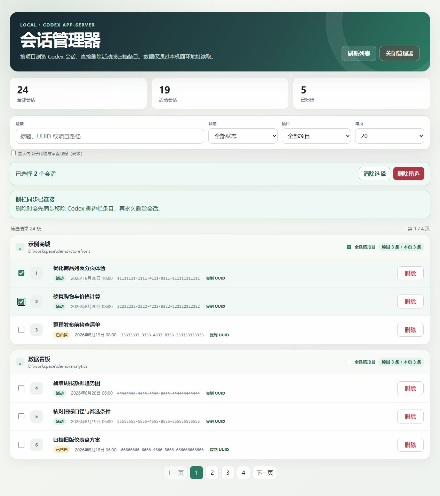

# Direct Thread Delete

[中文文档](docs/README.zh-CN.md)

Direct Thread Delete is a local Codex plugin for browsing, filtering, selecting, and permanently deleting Codex tasks by project while keeping the Codex Desktop sidebar synchronized.

## Runtime preview



> The screenshot uses fully synthetic project names, task titles, paths, and UUIDs. It contains no real Codex task data.

## Features

- Organizes tasks by project in collapsible directory trees.
- Supports search, status filters, project filters, pagination, and page-size controls.
- Provides a delete button on every row.
- Supports multi-select, project-wide selection, and batch deletion across pages.
- Lists both active and archived tasks.
- Supports exact deletion by UUID.
- Verifies that each target is absent from local task storage after deletion.
- Runs the manager and backend locally, with the page bound to a loopback address only.

## Deletion and sidebar synchronization

The user confirms each deletion only once in the manager. For an active task, the plugin first uses Codex Desktop's task archive capability to remove the sidebar entry, then permanently deletes the task through the supported `thread/delete` app-server method. Tasks that are already archived proceed directly to permanent deletion.

This internal archive transition is only the sidebar-synchronization phase of the same delete operation; the user never needs to click **Archive** manually. If synchronization fails, the backend does not continue with permanent deletion.

## Install

Run the following commands on the target device:

```powershell
codex plugin marketplace add Lucency09/direct-thread-delete
codex plugin add direct-thread-delete@lucency09
```

Restart Codex Desktop after installation, start a new task, and invoke `@Direct Thread Delete`. The plugin launches and opens the task manager directly.

## Update

After the repository is updated, run the following commands on the target device:

```powershell
codex plugin marketplace upgrade lucency09
codex plugin add direct-thread-delete@lucency09
```

Then restart Codex Desktop and use the updated plugin from a new task.

## Usage

1. In a dedicated Codex task that will host the manager, invoke `@Direct Thread Delete`.
2. Wait until the page displays **Sidebar sync connected**. Delete controls remain disabled until the coordinator connects, preventing stale sidebar entries.
3. Search for tasks or expand a project, then select the tasks to delete.
4. Review the exact targets in the confirmation dialog and confirm permanent deletion.
5. When finished, select **Close manager** to stop the page, coordinator, and local backend together.

Do not delete the task currently hosting the manager. The plugin protects the task that launched the manager, but using a dedicated management task is still recommended.

## Runtime and dependencies

- Designed for Codex Desktop and its local `codex` CLI.
- The current version is primarily verified on Codex Desktop for Windows.
- The Python implementation uses the standard library only; it does not require PyYAML or any other third-party Python package.
- If neither `python` nor `py -3` is registered, the plugin can use the Python runtime bundled with Codex Desktop.
- Both ChatGPT-account and API-key login modes are supported; the plugin does not read or modify `auth.json`.

On first use, Codex may request permission to access the current Windows user's native `.codex` state directory and temporary directory. This permission is used only for the supported task-listing and deletion protocols and does not include credential access.

## Safety design

- Exact-target confirmation is required before permanent deletion.
- Batch deletion requires the target and confirmation lists to match exactly.
- A sidebar synchronization failure stops the deletion instead of leaving a partially completed state.
- The current manager-hosting task is protected.
- Session JSONL files are never removed manually, and Codex SQLite databases are never edited directly.
- Authentication credentials are never read, copied, or modified.
- The backend listens only on loopback and coordinates the manager through a temporary bearer token.
- Background processes on Windows run without console windows.

## Uninstall

```powershell
codex plugin remove direct-thread-delete@lucency09
codex plugin marketplace remove lucency09
```

Uninstalling the plugin does not restore tasks that were previously deleted permanently.

## Repository layout

```text
direct-thread-delete/
├─ .agents/plugins/marketplace.json
├─ docs/
│  ├─ README.zh-CN.md
│  └─ images/runtime-ui-redacted.png
└─ plugins/direct-thread-delete/
   ├─ .codex-plugin/plugin.json
   └─ skills/direct-thread-delete/
      ├─ SKILL.md
      ├─ assets/
      └─ scripts/
```
